# Introduction

The R package `qtlpoly` (v. 0.2.1) [@Pereira2020] is an under development software to map multiple quantitative trait loci (QTL) in full-sib families of outcrossing autopolyploid species. It is based on the following random-effect model:

$$\boldsymbol{y} = \boldsymbol{1}\mu + \sum_{q=1}^Q \boldsymbol{g}_q + \boldsymbol{e}$$

where the vector of phenotypic values from a specific trait $\boldsymbol{y}$ is a function of the fixed intercept $\mu$, the $q = 1, \dots, Q$ random QTL effects $\boldsymbol{g}_q \sim \mathcal{N}(\boldsymbol{0}, \boldsymbol{G}_q\sigma^2_q)$, and the random environmental error $\boldsymbol{e} \sim \mathcal{N}(\boldsymbol{0}, \boldsymbol{I}\sigma^2)$. $\boldsymbol{G}_q$ is the additive relationship matrix between full-sibs derived from the genotype conditional probabilities of QTL $q$. See model details in @Pereira2020.

Variance components associated with putative QTL ($\sigma^2_q$) are tested using score statistics from the R package `varComp` (v. 0.2-0) [@Qu2013]. Final models are fitted using residual maximum likelihood (REML) from the R package `sommer` (v. 3.6) [@Covarrubias-Pazaran2016]. Plots for visualizing the results are based on `ggplot2` (v. 3.1.0) [@Wickham2016]. 

This tutorial used R version 4.0.3 (2020-10-10) running on either Ubuntu 18.04.1 LTS (64-bit) or Windows 10.

## Install and load the `qtlpoly` package and data

As mentioned, the package `qtlpoly` depends on a couple of functions from `sommer` (v. 3.6) and `varComp` (v. 0.2-0). `varComp` has been [archived from CRAN](https://cran.r-project.org/src/contrib/Archive/varComp/), while `sommer` has been constantly updated. In order to avoid conflict with updates in functions and object structures, we decided to stick with an earlier `sommer` version (v. 3.6), so you will need to downgrade if you have installed the most recent version of `sommer`.

`qtlpoly` package is available at [GitHub](https://github.com/guilherme-pereira/qtlpoly). You can install all needed packages within R using the functions from the R package `devtools`:


```r
> install.packages(c("devtools", "data.table"))
> devtools::install_url("https://cran.r-project.org/src/contrib/Archive/SPA3G/SPA3G_1.0.tar.gz")
> devtools::install_url("https://cran.r-project.org/src/contrib/Archive/varComp/varComp_0.2-0.tar.gz")
> devtools::install_version("sommer", version = "3.6", repos = "http://cran.us.r-project.org", 
+     upgrade = FALSE)
> devtools::install_github("guilherme-pereira/qtlpoly", upgrade = FALSE)
```

Then, use the function `library()` -- or `require()` -- to load the package, and the function `data()` to preload the simulated linkage map and phenotypic data that comes with the package:


```r
> library(qtlpoly)
> data(maps6x)
> data(pheno6x)
```

These simulated data were made simpler, so that one could run the functions along with this tutorial in a regular personal computer (with 4 cores and 6 GB of RAM, minimum). For real data analyses, you may need to run an R script in a cluster with more cores and RAM, though. In general, the computational needs depend on ploidy level, population size and number of markers.

The data was based on a full-sib family ($N = 300$) simulated from a cross between two parents from a putative autohexaploid species with three chromosomes. The simulated linkage map consists of three linkage groups (LGs) with 1,310 markers, spanning 274.76 centiMorgans (cM) in total. Please see details on the map construction for this simulated cross using `mappoly` [here](https://mmollina.github.io/tutorials/hexa_fake/haxaploid_map_construction.html).

The phenotypic data contains three traits, and it is a simple table with traits in columns and individuals in rows. For example:


```r
> head(pheno)
##              T32        T17        T45
## Ind_1 -0.1698446 -0.9332320 -1.2259338
## Ind_2  2.5319356  0.1997378 -1.8004184
## Ind_3  1.3669074  1.0584794 -0.7980037
## Ind_4  0.7955652 -1.7186921  1.5834176
## Ind_5  1.3168502 -0.7119421  1.3099067
## Ind_6 -0.8778211 -0.2339543 -0.6323779
```

Trait means were simulated as zero, i.e. $\mu = 0$ . Environmental variances were simulated from a standard normal distribution, i.e. $\sigma^2_e = 1$. QTL were simulated as described below:

* 'T32': 3 QTL, with heritabilities of 0.20 (LG 1 at 32.03 cM), 0.15 (LG 1 at 95.02 cM) and 0.30 (LG 2 at 40.01 cM), i.e. $\sigma^2_q = \{0.60, 0.45, 0.80\}$;
* 'T17': 1 QTL, with heritability of 0.17 (LG 3 at 34.51 cM), i.e. $\sigma^2_q = 0.20$;
* 'T45': no QTL.

# Conditional probabilities

Our `qtlpoly` package is fully integrated with `mappoly` [@Mollinari2019], so that if you have a map built using another software, you will need to re-estimate it using functions from `mappoly` -- or, at least, mimic the 'mappoly.map' object structure (good luck with that!). Please refer to its [tutorial](https://github.com/mmollina/MAPPoly) in order to learn more about the software. 

To install `mappoly`, simply use the following command:


```r
> devtools::install_github("mmollina/MAPpoly")
```

`mappoly` uses hidden Markov model (HMM) adapted from @Landert1987 to autopolyploids to estimate the genotype conditional probabilities of putative QTL given an ordered set of markers comprising a linkage map [@Mollinari2019]. These conditional probabilities are ultimately used for QTL mapping by `qtlpoly`.

To compute the conditional probabilities for each linkage group, one should use the function `calc_genoprob()` from `mappoly`:


```r
> library(mappoly)
> genoprob <- lapply(maps, calc_genoprob)
## 	Ploidy level: 6
## 	Number of markers: 538
## 	Number of individuals: 300
## 	..................................................
## 	..................................................
## 	..................................................
## 	..................................................
## 	..................................................
## 	..................................................
## 	
## 	Ploidy level: 6
## 	Number of markers: 329
## 	Number of individuals: 300
## 	..................................................
## 	..................................................
## 	..................................................
## 	..................................................
## 	..................................................
## 	..................................................
## 	
## 	Ploidy level: 6
## 	Number of markers: 443
## 	Number of individuals: 300
## 	..................................................
## 	..................................................
## 	..................................................
## 	..................................................
## 	..................................................
## 	..................................................
## 	
```

# Prepare data

Once the conditional probabilities have been calculated, you can use the function `read_data()` to read both 'genoprob' and 'pheno' objects. Row names (individuals) on 'pheno' must match the individual names from the 'genoprob' object. The argument `ploidy = 6` informs the ploidy level of the cross, i.e. a hexaploid cross in this case. Finally, `step = 1` provides the step size, so that only positions at every 1 cM (approximately) will be tested: 


```r
> data <- read_data(ploidy = 6, geno.prob = genoprob, pheno = pheno, step = 1)
## Reading the following data: 
##   Ploidy level:       6
##   No. individuals:    300
##   No. linkage groups: 3
##   Step size:          1 cM 
##   Map size:           274.76 cM (263 positions) 
##   No. phenotypes:     3
```

If you want to see detailed information on the map (number of positions per linkage group) and the phenotypes (number of individuals with non-missing values per trait), use a `print()` function with `detailed = TRUE`:


```r
> print(data, detailed = TRUE)
## This is an object of class 'qtlpoly.data'
##   Ploidy level:       6
##   No. individuals:    300
##   No. linkage groups: 3
##   Step size:          1 cM 
##   Map size:           274.76 cM (263 positions) 
##     LG 1: 116.39 cM (112 positions) 
##     LG 2: 55.41 cM (52 positions) 
##     LG 3: 102.95 cM (99 positions) 
##   No. phenotypes:     3
##     Trait 1: 'T32' (300 individuals) 
##     Trait 2: 'T17' (300 individuals) 
##     Trait 3: 'T45' (300 individuals)
```

Notice that regardless of the number of markers per linkage group, we will rather evaluate only a limited number of positions, given the `step` argument (in our example, every 1 cM). Because of the quite large linkage disequilibrium blocks in mapping populations, specially in full-sib families with relatively small sample sizes (let us say, $N < 300$), there is no need to test every single marker in the map. Moreover, with such marker density (e.g., 5+ markers/cM), a lot of markers will contain redundant information for QTL mapping purposes anyway. `step = NULL` will allow to test every single marker in a high density map if one wants to do so, but be sure that computational time (and needed RAM for loading 'qtlpoly.data' object) will be hugely increased.

# Perform QTL detection

Building a multiple QTL model is considered a model selection problem, and there are several ways to approach it. Here, we adapted the algorithm proposed by @Kao1999 for fixed-effect multiple interval mapping (MIM) for diploids to our random-effect MIM (REMIM) for polyploids, which is summarized as follows:

0. Null model: for each trait, a model starts with no QTL
$$\boldsymbol{y} = \boldsymbol{1}\mu + \boldsymbol{e}$$
1. Forward search: QTL ($q = 1, \dots, Q$) are added one at a time, conditional to the one(s) (if any) already in the model, under a less stringent threshold (e.g., $P < 0.01$)
$$\boldsymbol{y} = \boldsymbol{1}\mu + \sum_{q=1}^Q \boldsymbol{g}_q + \boldsymbol{e}$$
2. Model optimization: each QTL $r$ is tested again conditional to the remaining one(s) in the model under a more stringent threshold (e.g., $P < 10^{-4}$)
$$\boldsymbol{y} = \boldsymbol{1}\mu + \boldsymbol{g}_r + \sum_{q \neq r} \boldsymbol{g}_q + \boldsymbol{e}$$
Steps 1 and 2 are repeated until no more QTL can be added to or dropped from the model, and positions of the remaining QTL do not change. After the first model optimization, the following forward searches use the more stringent threshold (e.g., $P < 10^{-4}$) as the detection power is expected to increase once QTL have already been added to the model.
3. QTL profiling: score statistics for the whole genome are updated conditional to the final set of selected QTL.

It is worth to mention that there is no such definitive way to perform model selection. One may try to come up with alternative ways of building a multiple QTL model, some of which will be mentioned later. `qtlpoly` tries to provide functions flexible enough, so that the users can build a multiple QTL model on their own, manually. One strategy we have used the most and tested through simulations implements the above-mentioned algorithm of building a multiple QTL model, and will be demonstrated here.

## Manual search

### 0. Null model

The function `null_mod()` runs the first round of score statistics along the genome for the traits specified by `pheno.col`, which contains a vector of column numbers from 'pheno' that one wants to analyze. If `pheno.col = NULL` (the default), all traits in 'data' will be analyzed. All the subsequent functions will inherit this set of selected traits:


```r
> null.mod <- null_model(data = data, n.clusters = 4, plot = "null")
## INFO: Using 4 CPUs for calculation
## 
## Null model for trait 1 'T32' 
##   Calculation took 145.36 seconds
## 
## Null model for trait 2 'T17' 
##   Calculation took 183.75 seconds
## 
## Null model for trait 3 'T45' 
##   Calculation took 157.2 seconds
```

Progress is shown as `verbose = TRUE` by default. Plot files named after the trait name with the logarithm of $P$-value [$LOP = -\log_{10}(P)$] are saved in the current working directory as 'T32_null.pdf', for example. Notice that 4 cores are requested for parallel analysis by `n.clusters = 4`, which speeds up the process. 

A `print()` function summarizes any 'qtlpoly.model' object containing QTL (if any), including 'qtlpoly.null':


```r
> print(null.mod)
## This is an object of class 'qtlpoly.null'
## 
## * Trait 1 'T32' 
## There are no QTL in the model 
## 
## * Trait 2 'T17' 
## There are no QTL in the model 
## 
## * Trait 3 'T45' 
## There are no QTL in the model
```

### 1. Forward search

Once the first run of score statistics has been carried out, you can start looking for QTL. `w.size = 15` sets a distance of 15 cM on either side of QTL already in the model where another putative QTL should not be considered due to high linkage disequilibrium. This window size value will be the same to be used from now on. During the first forward search, it is recommended to use a less stringent significance level such as `sig.fwd = 0.01`, so that more positions are allowed to be tested in the next step. Progress is shown for each QTL included in the model as `verbose = TRUE`:


```r
> search.mod <- search_qtl(data = data, model = null.mod, w.size = 15, sig.fwd = 0.01, 
+     n.clusters = 4, plot = "search")
## INFO: Using 4 CPUs for calculation
## 
## Forward search for trait 1 'T32'; there are no QTL in the model 
##   QTL was found on LG 2 at 41.2 cM (position number 152)
##   QTL was found on LG 1 at 37.21 cM (position number 37)
##   QTL was found on LG 1 at 104.28 cM (position number 100)
##   QTL was found on LG 3 at 17.81 cM (position number 181)
##   No more QTL were found. A putative QTL on LG 1 at 68.28 cM (position number 67) did not reach the threshold; its p-value was 0.02338
##   Calculation took 1707.96 seconds
## 
## Forward search for trait 2 'T17'; there are no QTL in the model 
##   QTL was found on LG 3 at 29.18 cM (position number 193)
##   QTL was found on LG 1 at 96.21 cM (position number 92)
##   No more QTL were found. A putative QTL on LG 2 at 27.01 cM (position number 138) did not reach the threshold; its p-value was 0.03342
##   Calculation took 461.2 seconds
## 
## Forward search for trait 3 'T45'; there are no QTL in the model 
##   QTL was found on LG 3 at 12.58 cM (position number 176)
##   QTL was found on LG 2 at 33.3 cM (position number 144)
##   No more QTL were found. A putative QTL on LG 1 at 113.17 cM (position number 109) did not reach the threshold; its p-value was 0.01932
##   Calculation took 482.21 seconds
```

The last putative QTL position that does not reach the threshold is printed together with its $P$-value. The default `n.rounds = Inf` will let the function run consecutive rounds until no more significant positions can be found. Make sure to set `n.rounds = 1` to limit the number of QTL included in the model to only the most significant one. 

A `print()` function summarizes the QTL in the current model:


```r
> print(search.mod)
## This is an object of class 'qtlpoly.search'
## 
## * Trait 1 'T32' 
##   LG    Pos Nmrk    Mrk  Score      Pval
## 1  2  41.20  152  M_903 503.69 <2.22e-16
## 2  1  37.21   37  M_180 367.86  1.95e-09
## 3  1 104.28  100  M_534 276.55  4.87e-07
## 4  3  17.81  181 M_1056  52.20  7.36e-02
## 
## * Trait 2 'T17' 
##   LG   Pos Nmrk    Mrk  Score     Pval
## 1  3 29.18  193 M_1156 264.14 1.32e-06
## 2  1 96.21   92  M_493 111.55 4.77e-03
## 
## * Trait 3 'T45' 
##   LG   Pos Nmrk    Mrk  Score     Pval
## 1  3 12.58  176 M_1040 182.60 1.47e-04
## 2  2 33.30  144  M_854 131.32 1.88e-03
```

In our example, four, two and two QTL have been added to models for the respective traits 'T32', 'T17' and 'T45'. 

It is worth to mention that `<2.22e-16` is used to represent that the test has reached such small $P$-value that R could not store it precisely (because of the floating point precision limit). Notice that this does not affect our model selection because we take the _highest score_ value instead, which can always be assessed -- i.e., it provides the most likely position for the QTL, although we cannot precisely tell how significant it is.

This example uses `polygenes = FALSE` (the default), which means that a variance component for every QTL has to be estimated, as the equation at the [Introduction]. `polygenes = TRUE` provides the same results for this example (and will most likely do so for the vast majority of cases), but in less computational time. For example, the same four QTL have been detected for trait 'T32' using `polygenes = TRUE`, but it took 268.13 seconds, instead of 401.83 seconds. Much difference will not be noticed if only few QTL were added to the model. For example, computational time for traits 'T17' and 'T45' was 129.26 and 129.24 seconds, respectively, when using `polygenes = TRUE`, instead of 152.00 and 153.74 seconds. 

This is because the model becomes $\boldsymbol{y} = \boldsymbol{1}\mu + \boldsymbol{g}_r + \boldsymbol{g}^* + \boldsymbol{e}$, where $\boldsymbol{g}_r$ is the the new QTL $r$ being tested and $\boldsymbol{g}^*$ is the polygenic effect (all QTL $q \neq r$ already in the model summarized into one single random effect), with only two variance components to estimate (plus the residual variance). So, for instance, if you already have three QTL in a model and are looking for a forth one, `polygenes = FALSE` will use the full model to estimate four variance components associated with each QTL, whereas `polygenes = TRUE` will force the algorithm to estimate only two variance components: one for the new QTL being tested and one for the polygenic effect. 

### 2. Model optimization

Once the first run of forward search has been carried out for each trait, a set of putative QTL may have been identified. Now, you have to test the QTL again under a more stringent significance level such as `sig.bwd = 0.0001`. Each QTL will be tested conditional to the other(s) QTL(s) in the model, and there are three possible outcomes:

1. QTL is still significant and its position does not change: QTL is kept as is;

2. QTL is significant, but in a different position in the linkage group: QTL position is updated (process called "position refinement");

3. QTL is not significant: QTL is dropped (referred to as "backward elimination").

Rounds of model optimization are repeated until no more QTL have their positions updated or are dropped. This process is documented in a series of plots in a PDF file named after each trait (e.g. 'T32_optimize.pdf') with a suffix as in `plot = "optimize"`:


```r
> optimize.mod <- optimize_qtl(data = data, model = search.mod, sig.bwd = 1e-04, 
+     n.clusters = 4, plot = "optimize")
## INFO: Using 4 CPUs for calculation
## 
## Model optimization for trait 1 'T32'; there are 4 QTL in the model already 
##   Refining QTL positions ... 152 ... 33 ... 100 ... 181 
##   Excluding non-significant QTL ... 181 
##   Refining QTL positions ... 152 ... 33 ... 100 
##   Calculation took 3887.86 seconds
## 
## Model optimization for trait 2 'T17'; there are 2 QTL in the model already 
##   Refining QTL positions ... 191 ... 92 
##   Excluding non-significant QTL ... 92 
##   Refining QTL positions ... 191 
##   Calculation took 475.93 seconds
## 
## Model optimization for trait 3 'T45'; there are 2 QTL in the model already 
##   Refining QTL positions ... 178 ... 144 
##   Excluding non-significant QTL ... 144 
##   Refining QTL positions ... 178 
##   Excluding non-significant QTL ... 178 
##   Calculation took 435.36 seconds
```

In our example, one QTL was dropped from the models for the traits 'T32' and 'T17' each. All two QTL were dropped from the model for the trait 'T45'. For the trait 'T32', notice that the QTL initially at the position 98 had its position updated to 100 after one QTL was excluded.

You can use the function `print()` to have a summary of the optimized model:


```r
> print(optimize.mod)
## This is an object of class 'qtlpoly.optimize'
## 
## * Trait 1 'T32' 
##   LG    Pos Nmrk   Mrk  Score      Pval
## 1  2  41.20  152 M_903 548.00 <2.22e-16
## 2  1  37.21   33 M_167 381.02 <2.22e-16
## 3  1 104.28  100 M_534 281.70  3.94e-08
## 
## * Trait 2 'T17' 
##   LG   Pos Nmrk    Mrk  Score     Pval
## 1  3 29.18  193 M_1156 264.14 1.32e-06
## 
## * Trait 3 'T45' 
## There are no QTL in the model
```

The current optimized models can be used in the `model` argument for a new search, so that more QTL may be detected under a more stringent criteria such as `sig.fwd = 0.0001`. Remember to chance the suffix to be used for the PDF file, or previous '_search.pdf' file will be overwritten:


```r
> search.mod2 <- search_qtl(data = data, model = optimize.mod, sig.fwd = 1e-04, 
+     n.clusters = 4, plot = "search2")
## INFO: Using 4 CPUs for calculation
## 
## Forward search for trait 1 'T32'; there are 3 QTL in the model already 
##   No more QTL were found. A putative QTL on LG 3 at 14.3 cM (position number 178) did not reach the threshold; its p-value was 0.00336
##   Calculation took 776.62 seconds
## 
## Forward search for trait 2 'T17'; there is 1 QTL in the model already 
##   No more QTL were found. A putative QTL on LG 1 at 96.21 cM (position number 92) did not reach the threshold; its p-value was 0.00177
##   Calculation took 519.81 seconds
## 
## Forward search for trait 3 'T45'; there are no QTL in the model 
##   No QTL were found. A putative QTL on LG 3 at 12.58 cM (position number 176) did not reach the threshold; its p-value was 0.00015
##   Calculation took 0 seconds
```

In our example, no more QTL reached the significance level, so the `print()` function outputs the same results we have seen before:


```r
> print(search.mod2)
## This is an object of class 'qtlpoly.search'
## 
## * Trait 1 'T32' 
##   LG    Pos Nmrk   Mrk  Score      Pval
## 1  2  41.20  152 M_903 548.00 <2.22e-16
## 2  1  37.21   33 M_167 381.02 <2.22e-16
## 3  1 104.28  100 M_534 281.70  3.94e-08
## 
## * Trait 2 'T17' 
##   LG   Pos Nmrk    Mrk  Score     Pval
## 1  3 29.18  193 M_1156 264.14 1.32e-06
## 
## * Trait 3 'T45' 
## There are no QTL in the model
```

If more QTL were added, new model optimization would have to be run. This process can be repeated as many times as needed until no more QTL are added to or dropped from the model.

### 3. QTL profiling

Once a final QTL model is defined, one should run the function `profile_qtl()` in order to get $P$-value profiles from the whole genome conditional to the QTL in the provided model. At this point, support interval for each QTL is computed. Support intervals are defined as the QTL peak neighboring region with $LOP$ greater than or equal $LOP-d$, where $d$ is a constant which subtracts the highest $LOP$ (i.e., from the QTL peak) in that region, as similarly proposed by @Landert1987 for the statistic "logarithm of the odds", also known as LOD scores. Here, $d$ value is given as `d.sint = 1.5`:


```r
> profile.mod <- profile_qtl(data = data, model = optimize.mod, d.sint = 1.5, 
+     polygenes = FALSE, n.clusters = 4, plot = "profile")
## INFO: Using 4 CPUs for calculation
## 
## QTL profile for trait 1 'T32'; there are 3 QTL in the model 
##   Profiling QTL ... 33 ... 100 ... 152 
##   Calculation took 1233.72 seconds
## 
## QTL profile for trait 2 'T17'; there is 1 QTL in the model 
##   Profiling QTL ... 193 
##   Calculation took 204.22 seconds
## 
## QTL profile for trait 3 'T45'; there are no QTL in the model 
##   Calculation took 84.17 seconds
```

A `print()` gives the final statistics for each QTL:


```r
> print(profile.mod)
## This is an object of class 'qtlpoly.profile'
## 
## * Trait 1 'T32' 
##   LG    Pos Nmrk   Mrk  Score      Pval
## 1  1  33.07   33 M_167 381.02 <2.22e-16
## 2  1 104.28  100 M_534 281.70  3.94e-08
## 3  2  41.20  152 M_903 548.00 <2.22e-16
## 
## * Trait 2 'T17' 
##   LG   Pos Nmrk    Mrk  Score     Pval
## 1  3 29.18  193 M_1156 264.14 1.32e-06
## 
## * Trait 3 'T45' 
## There are no QTL in the model
```

For objects of class 'qtlpoly.profile', you can also choose to print both lower and upper support intervals:


```r
> print(profile.mod, sint = "lower")
## This is an object of class 'qtlpoly.profile'
## 
## * Trait 1 'T32' 
##   LG Pos_lower Nmrk_lower Mrk_lower Score_lower Pval_lower
## 1  1     33.07         33     M_167      381.02  <2.22e-16
## 2  1     87.16         86     M_473      251.30   1.89e-07
## 3  2     35.02        146     M_870      417.80  <2.22e-16
## 
## * Trait 2 'T17' 
##   LG Pos_lower Nmrk_lower Mrk_lower Score_lower Pval_lower
## 1  3     20.01        184    M_1078      208.75   3.60e-05
## 
## * Trait 3 'T45' 
## There are no QTL in the model
```


```r
> print(profile.mod, sint = "upper")
## This is an object of class 'qtlpoly.profile'
## 
## * Trait 1 'T32' 
##   LG Pos_upper Nmrk_upper Mrk_upper Score_upper Pval_upper
## 1  1     35.21         35     M_175      379.93  <2.22e-16
## 2  1    106.08        102     M_538      231.58   1.11e-06
## 3  2     47.37        156     M_925      424.91  <2.22e-16
## 
## * Trait 2 'T17' 
##   LG Pos_upper Nmrk_upper Mrk_upper Score_upper Pval_upper
## 1  3     53.03        215    M_1242      230.75   1.04e-05
## 
## * Trait 3 'T45' 
## There are no QTL in the model
```

According to simulations [@Pereira2020], $d = 1.5$ was found to represent a support interval of ~95\% of coverage; $d= 1.0$ corresponds to ~90\%, and $d=2.0$ to ~97\%. Obviously, the greater the coverage, the broader the support interval interval.

## Add/drop QTL to/from the model

Suppose you have information (from previous work, for instance) that can help you to decide whether a QTL should be in the model or not. You can take advantage of the function `modify_qtl()` to either include or exclude a certain putative QTL from the model. For example, let us say we want to add a QTL to the trait 3 'T17' model on LG 3 at 13.03 cM (position number 184), which has not reached the most stringent threshold when a second search was performed after (see the results from the step [2. Model optimization]). We simply choose the `pheno.col` and the position where we want a QTL to be added, i.e. `add.qtl = 184`:


```r
> modified.mod <- modify_qtl(model = profile.mod, pheno.col = 3, add.qtl = 184)
## Model modification for trait 3 'T45'; there are no QTL in the model 
##   QTL was added on LG 3 at 20.01 cM (position number 184)
```

The function `print()` shows how the model has been modified:


```r
> print(modified.mod)
## This is an object of class 'qtlpoly.modify' and it has not been profiled yet
## 
## * Trait 1 'T32' 
##   LG    Pos Nmrk   Mrk  Score      Pval
## 1  1  33.07   33 M_167 381.02 <2.22e-16
## 2  1 104.28  100 M_534 281.70  3.94e-08
## 3  2  41.20  152 M_903 548.00 <2.22e-16
## 
## * Trait 2 'T17' 
##   LG   Pos Nmrk    Mrk  Score     Pval
## 1  3 29.18  193 M_1156 264.14 1.32e-06
## 
## * Trait 3 'T45' 
##   LG   Pos Nmrk    Mrk  Score     Pval
## 1  3 20.01  184 M_1078 135.74 1.64e-03
```

Notice that since the model has not been profiled yet, statistics may change.

Now, suppose you want to drop the least significant QTL from the trait 1 'T32' model. You would have to use `drop.qtl = 100` instead:


```r
> modified.mod2 <- modify_qtl(model = modified.mod, pheno.col = 1, drop.qtl = 100)
> print(modified.mod2)
## Model modification for trait 1 'T32'; there are 3 QTL in the model already 
##   QTL was dropped from LG 1 at 104.28 cM (position number 100) 
## 
## This is an object of class 'qtlpoly.modify' and it has not been profiled yet
## 
## * Trait 1 'T32' 
##   LG   Pos Nmrk   Mrk  Score      Pval
## 1  1 33.07   33 M_167 381.02 <2.22e-16
## 2  2 41.20  152 M_903 548.00 <2.22e-16
## 
## * Trait 2 'T17' 
##   LG   Pos Nmrk    Mrk  Score     Pval
## 1  3 29.18  193 M_1156 264.14 1.32e-06
## 
## * Trait 3 'T45' 
##   LG   Pos Nmrk    Mrk  Score     Pval
## 1  3 20.01  184 M_1078 135.74 1.64e-03
```

Once modifications have been suggested, run the function `profile()` in order to obtain updated statistics:


```r
> profile.mod2 <- profile_qtl(data = data, model = modified.mod2, d.sint = 1.5, 
+     polygenes = FALSE, n.clusters = 4, plot = "profile2")
## INFO: Using 4 CPUs for calculation
## 
## QTL profile for trait 1 'T32'; there are 2 QTL in the model 
##   Profiling QTL ... 37 ... 152 
##   Calculation took 409.78 seconds
## 
## QTL profile for trait 2 'T17'; there is 1 QTL in the model 
##   Profiling QTL ... 193 
##   Calculation took 194.8 seconds
## 
## QTL profile for trait 3 'T45'; there is 1 QTL in the model 
##   Profiling QTL ... 184 
##   Calculation took 194.95 seconds
```

Using `print()`, notice how positions and statistics may have changed:


```r
> print(profile.mod2)
## This is an object of class 'qtlpoly.profile'
## 
## * Trait 1 'T32' 
##   LG   Pos Nmrk   Mrk  Score      Pval
## 1  1 37.21   37 M_180 430.03 <2.22e-16
## 2  2 41.20  152 M_903 542.08 <2.22e-16
## 
## * Trait 2 'T17' 
##   LG   Pos Nmrk    Mrk  Score     Pval
## 1  3 29.18  193 M_1156 264.14 1.32e-06
## 
## * Trait 3 'T45' 
##   LG   Pos Nmrk    Mrk  Score     Pval
## 1  3 20.01  184 M_1078 135.74 1.64e-03
```

It is worth to mention that a modification should be considered carefully, as we may not have enough statistical support to hold it. Nevertheless, modification might be interesting to study how much of the phenotypic variance an added QTL can explain, regardless of its $P$-value, for example.

## Automatic search

The function `remim()` has the previous algorithm steps implemented in an automatic way, so that, for each trait, a null model is built, followed by iterations of forward search, model optimization and QTL profiling. Here, one must include both forward search (e.g., `sig.fwd = 0.01`) and backward elimination (e.g., `sig.bwd = 0.0001`) $P$-value thresholds:


```r
> remim.mod <- remim(data = data, w.size = 15, sig.fwd = 0.01, sig.bwd = 1e-04, 
+     d.sint = 1.5, n.clusters = 4, plot = "remim")
## INFO: Using 4 CPUs for calculation
## 
## REMIM for trait 1 'T32' 
##   QTL was found on LG 2 at 41.2 cM (position number 152)
##   QTL was found on LG 1 at 37.21 cM (position number 37)
##   QTL was found on LG 1 at 104.28 cM (position number 100)
##   QTL was found on LG 3 at 17.81 cM (position number 181)
##   No more QTL were found. A putative QTL on LG 1 at 68.28 cM (position number 67) did not reach the threshold; its p-value was 0.02338
##   Refining QTL positions ... 152 ... 33 ... 100 ... 181 
##   Excluding non-significant QTL ... 181 
##   Refining QTL positions ... 152 ... 33 ... 100 
##   Profiling QTL ... 33 ... 100 ... 152 
##   Calculation took 3339.51 seconds
## 
## REMIM for trait 2 'T17' 
##   QTL was found on LG 3 at 29.18 cM (position number 193)
##   QTL was found on LG 1 at 96.21 cM (position number 92)
##   No more QTL were found. A putative QTL on LG 2 at 27.01 cM (position number 138) did not reach the threshold; its p-value was 0.03342
##   Refining QTL positions ... 191 ... 92 
##   Excluding non-significant QTL ... 92 
##   Refining QTL positions ... 191 
##   Profiling QTL ... 193 
##   Calculation took 1139.29 seconds
## 
## REMIM for trait 3 'T45' 
##   QTL was found on LG 3 at 12.58 cM (position number 176)
##   QTL was found on LG 2 at 33.3 cM (position number 144)
##   No more QTL were found. A putative QTL on LG 1 at 113.17 cM (position number 109) did not reach the threshold; its p-value was 0.01932
##   Refining QTL positions ... 178 ... 144 
##   Excluding non-significant QTL ... 144 
##   Refining QTL positions ... 178 
##   Excluding non-significant QTL ... 178 
##   Calculation took 1138.8 seconds
```

With help of `verbose = TRUE`, notice that models for all traits had the same output as doing it step-by-step, using separate functions. This alternative also helps to run all the steps in a faster way, as the needed data for parallel processing have to be loaded into RAM only once. 

Use `print()` as before, and a similar table for each trait will be shown:


```r
> print(remim.mod)
## This is an object of class 'qtlpoly.remim'
## 
## * Trait 1 'T32' 
##   LG    Pos Nmrk   Mrk  Score      Pval
## 1  1  33.07   33 M_167 381.02 <2.22e-16
## 2  1 104.28  100 M_534 281.70  3.94e-08
## 3  2  41.20  152 M_903 548.00 <2.22e-16
## 
## * Trait 2 'T17' 
##   LG   Pos Nmrk    Mrk  Score     Pval
## 1  3 29.18  193 M_1156 264.14 1.32e-06
## 
## * Trait 3 'T45' 
## There are no QTL in the model
```

Since support intervals have been calculated, you can print them as well by specifying the `sint` argument properly:


```r
> print(remim.mod, sint = "lower")
## This is an object of class 'qtlpoly.remim'
## 
## * Trait 1 'T32' 
##   LG Pos_lower Nmrk_lower Mrk_lower Score_lower Pval_lower
## 1  1     33.07         33     M_167      381.02  <2.22e-16
## 2  1     87.16         86     M_473      251.30   1.89e-07
## 3  2     35.02        146     M_870      417.80  <2.22e-16
## 
## * Trait 2 'T17' 
##   LG Pos_lower Nmrk_lower Mrk_lower Score_lower Pval_lower
## 1  3     20.01        184    M_1078      208.75   3.60e-05
## 
## * Trait 3 'T45' 
## There are no QTL in the model
```


```r
> print(remim.mod, sint = "upper")
## This is an object of class 'qtlpoly.remim'
## 
## * Trait 1 'T32' 
##   LG Pos_upper Nmrk_upper Mrk_upper Score_upper Pval_upper
## 1  1     35.21         35     M_175      379.93  <2.22e-16
## 2  1    106.08        102     M_538      231.58   1.11e-06
## 3  2     47.37        156     M_925      424.91  <2.22e-16
## 
## * Trait 2 'T17' 
##   LG Pos_upper Nmrk_upper Mrk_upper Score_upper Pval_upper
## 1  3     53.03        215    M_1242      230.75   1.04e-05
## 
## * Trait 3 'T45' 
## There are no QTL in the model
```

You can always use the `modify_qtl()` function to [add/drop QTL to/from the model] originated by an automatic search. Remember to run the `profile_qtl()` function from the step [3. QTL profiling] in order to get updated positions and statistics for the new model, in case any modification is performed. 

## Plot profiles

Given the final profiled models, you can plot either individual or joint $LOP$ profiles using the function `plot_profile()`. For individual plots, one need to specify the `pheno.col` argument:


```r
> for (p in remim.mod$pheno.col) plot_profile(data = data, model = remim.mod, 
+     pheno.col = p, ylim = c(0, 10))
```

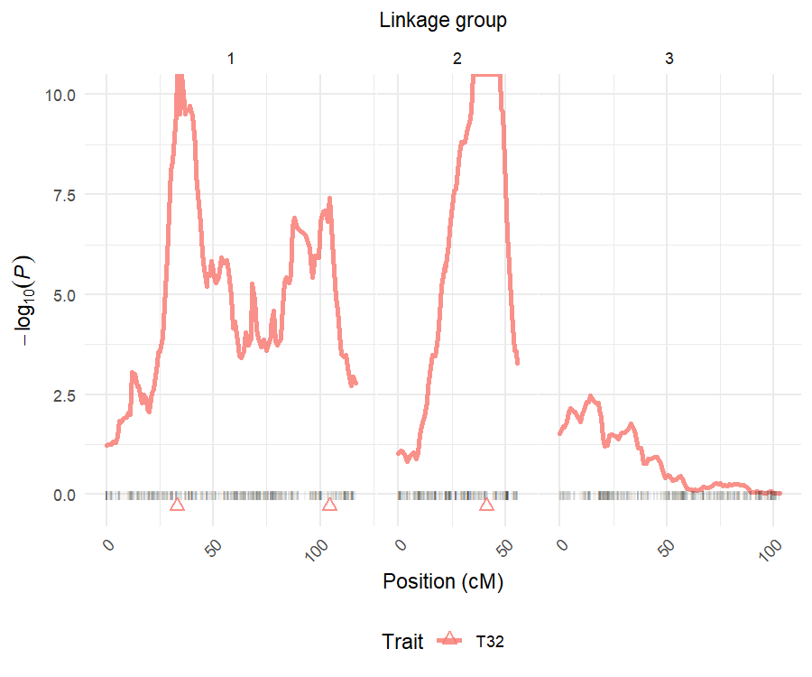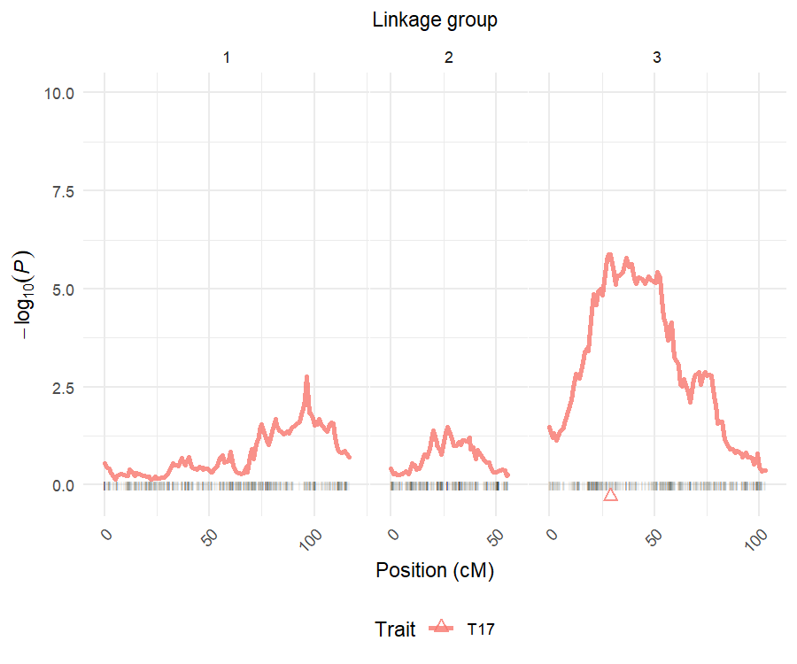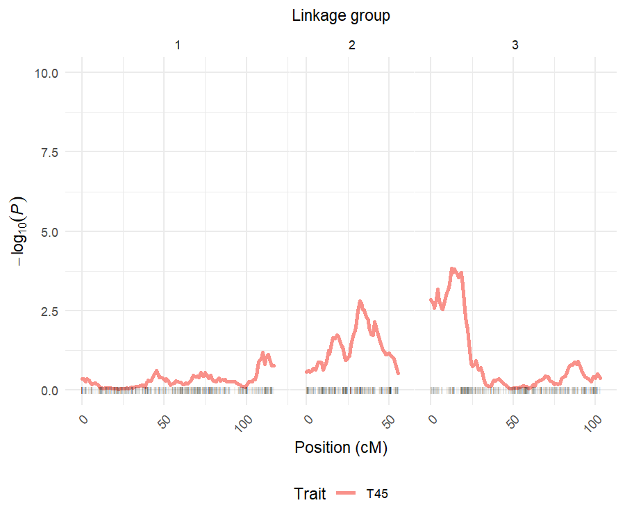

Triangles show where the mapped QTL peaks are located. By providing values to the y-axis limits using `ylim`, one makes sure that all plots will be at the same scales. 

If one wants to plot some or all QTL profiles at once for comparison, `pheno.col` needs to be specified as a vector of numbers representing the phenotype columns. As default, `pheno.col = NULL` includes all evaluated traits:


```r
> plot_profile(data = data, model = remim.mod, grid = TRUE)
```

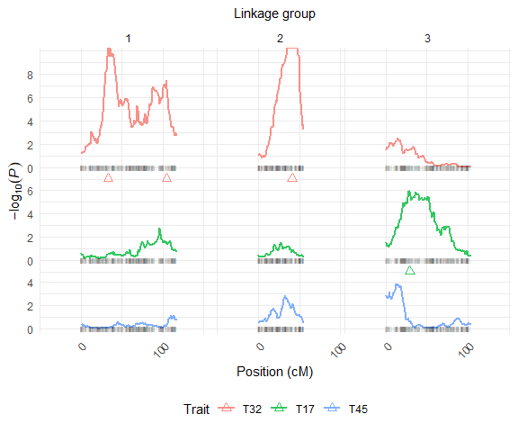

```r
> plot_profile(data = data, model = remim.mod, grid = FALSE)
```

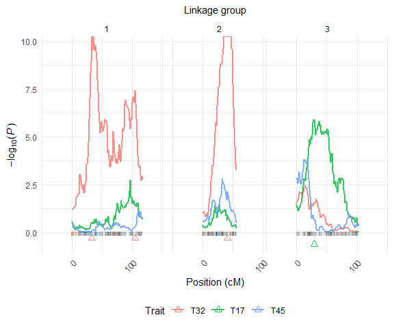

The argument `grid` organizes the multiple plots as a grid if `TRUE`, or superimposed profiles if `FALSE`.

## Support intervals

You can visualize the QTL distributed along the linkage map, together with their support intervals using the function `plot_sint()`: 


```r
> plot_sint(data = data, model = remim.mod)
```

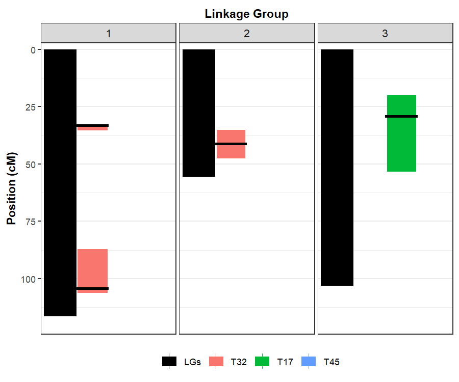

Notice that for highly significant QTL ($P < 2.22 \times 10^{-16}$), computing support intervals may not be very reliable, which is expected to be narrower than the support interval for the QTL on LG 2 for 'T32'. We used the same colors as in [plot profiles] to keep them consistent through plots. Obviously, no QTL are shown for the trait 3 'T45'.

# Fit multiple QTL models

Once final models have been defined, one may use REML to estimate their parameters by using the function `fit_model()`:


```r
> fitted.mod <- fit_model(data = data, model = remim.mod, probs = "joint", polygenes = "none")
## There are 3 QTL in the model for trait 1 'T32'. Fitting model... Done! 
## 
## There is 1 QTL in the model for trait 2 'T17'. Fitting model... Done! 
## 
## There are no QTL in the model for trait 3 'T45'. No model has been fitted!
```

Here, we used the joint probabilities of the putative QTL genotypes (`probs= "joint"`), instead of the parent marginal ones (`probs = "marginal"`). The latter may be interesting if one of the parents seems to not contribute much for a specific QTL (because all QTL allele effects are about the same, for example). Also, if `polygenes = "none"`, all individual QTL have their variance component estimated. One may choose to do `polygenes = "most"` if all but one QTL have to be combined as a polygenic effect, or `polygenes = "all"` if all QTL have to be combined as a polygenic effect. Finally, `keep = TRUE` (the default) saves matrices used on the calculations and additional results from `sommer`. One may want to assess standard errors from parameter estimates there, for example.

A `summary()` function shows parameter estimates together with the QTL heritabilities computed from the variance component estimates:


```r
> summary(fitted.mod)
## This is an object of class 'qtlpoly.fitted'
## 
## * Trait 1 'T32' 
##   LG    Pos Nmrk Intercept    Var(g)    Var(e)        h2
## 1  1  33.07   33        NA 0.4841676        NA 0.1905229
## 2  1 104.28  100        NA 0.3439428        NA 0.1353436
## 3  2   41.2  152        NA 0.7259981        NA 0.2856847
## 4 NA     NA   NA 0.0386968        NA 0.9871479 0.6115512
## 
## * Trait 2 'T17' 
##   LG   Pos Nmrk  Intercept    Var(g)   Var(e)        h2
## 1  3 29.18  193 -0.3377632 0.2142959 0.910072 0.1905923
## 
## * Trait 3 'T45' 
## There are no QTL in the model
```

At this point, we are able to compare our results with the simulated values presented at [install and load the `qtlpoly` package and data] section:

* 'T32': 3 QTL were detected, with heritabilities of 0.19 (LG 1 at 33.07 cM), 0.13 (LG 1 at 104.28 cM) and 0.28 (LG 2 at 41.20 cM), when we expected 0.20 (LG 1 at 32.03 cM), 0.15 (LG 1 at 95.02 cM) and 0.30 (LG 2 at 40.01 cM), respectively;
* 'T17': 1 QTL was detected, with heritability of 0.19 (LG 3 at 29.19 cM), when we expected 0.17 (LG 3 at 34.51 cM);
* 'T45': no QTL were detected, as expected.

## Plot QTL

After models have been fitted, one way of visualization you can use is the one provided by the function `plot_qtl()`:


```r
> plot_qtl(data = data, model = remim.mod, fitted = fitted.mod, drop.pheno = FALSE)
```

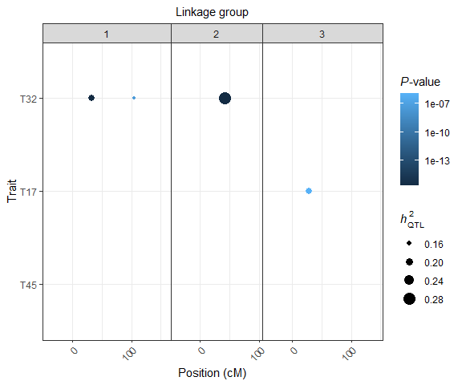

Dots are located on the respective chromosome positions of the QTL peaks. Size of the dots corresponds to the specific QTL heritability. Color of the dots corresponds to the $P$-values, and helps to identify the most or the less significant QTL. `drop = FALSE` makes sure all traits are displayed, even if they do not had any QTL detected.

## Estimate allele effects

Additive effects contributing to the overall mean by each allele individually as well as their combinations within each parent may be computed using the function `qtl_effects()` as follows:


```r
> est.effects <- qtl_effects(ploidy = 6, fitted = fitted.mod)
## There are 3 QTL in the model for trait 1 'T32'. Computing effects for QTL ... 33 ... 100 ... 152. Done! 
## 
## There is 1 QTL in the model for trait 2 'T17'. Computing effects for QTL ... 193. Done! 
## 
## There are no QTL in the model for trait 3 'T45'. Skipping!
```

A `plot()` function allows the user to visualize these contributions graphically:


```r
> plot(est.effects)
```

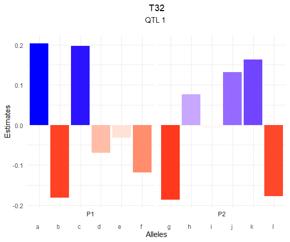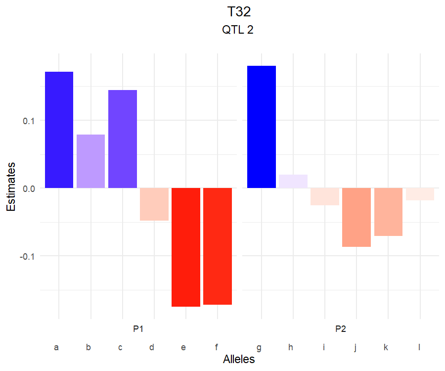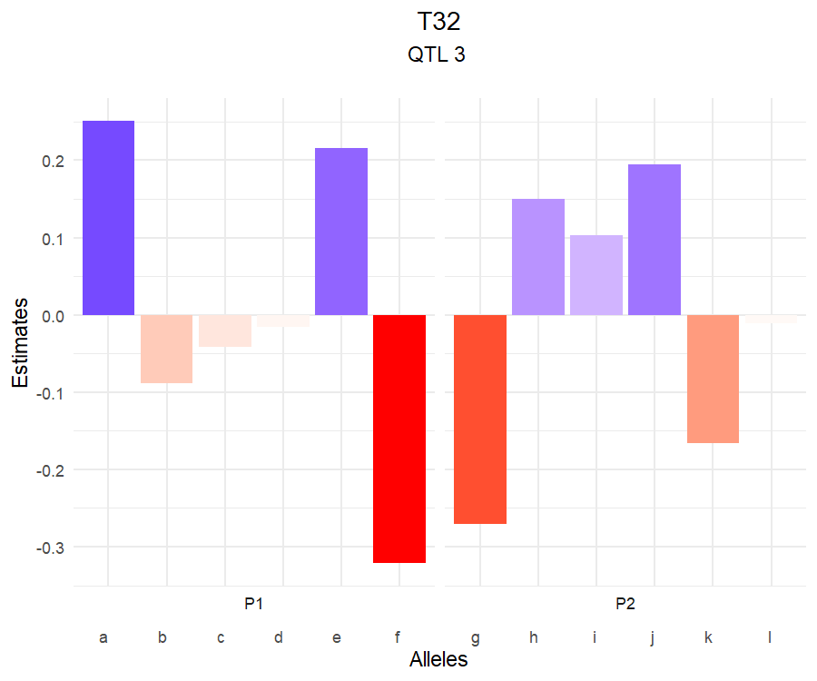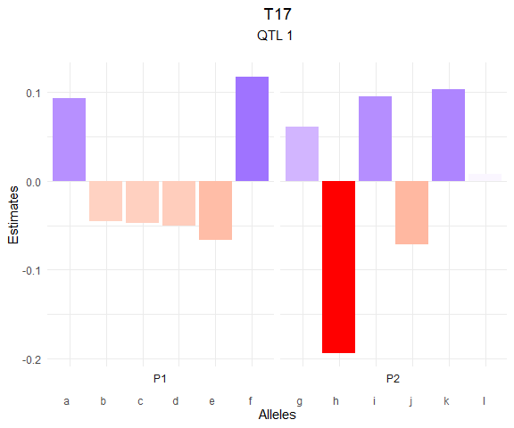

For each QTL, one will be able to see which alleles contribute the most to increase or decrease the phenotypic mean. This is interesting to plan marker-assisted selection strategies, for example, as specific alleles can be selected based on the marker dosage at or around the QTL peak and with assistance of the population linkage map from `mappoly`. For example, if one is interested in decreasing the value of the trait 'T17', the allele *i*, combined with *j* and *l* from the parent 'P2' must be targeted. On the other hand, the parent 'P1' does not seem to contribute much to the trait variation, although selecting for the alleles *b* through *e* must be the best way to achieve one's goal of decreasing the phenotypic value of 'T17'.

## Predict breeding values

Finally, with the estimates of the final models in hands, one can use them to perform predictions of the breeding values as follows:


```r
> y.hat <- breeding_values(data = data, fitted = fitted.mod)
```

A `plot()` function shows the distribution of the genotypic values for the population:


```r
> plot(y.hat)
```

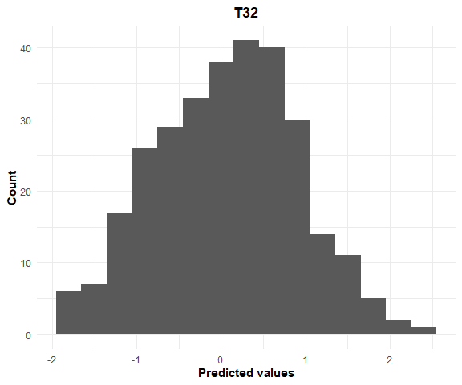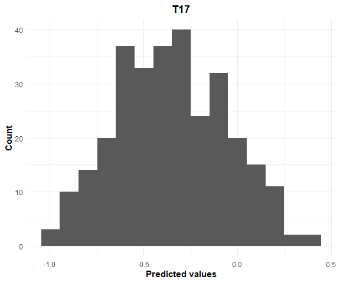

This may also be interesting for those populations whose individuals have been genotyped, but not phenotyped, and you still want to consider them when selecting the best genotypes.

# Compare with a fixed-effect approach

A previous fixed-effect interval mapping (here named FEIM) model has been proposed as a first approach to map QTL in autopolyploid species [@Hackett2014]. It consists of a single-QTL model, where every position is tested according to the model:

$$Y = \mu_C + \sum_{i=2}^{m} \alpha_i X_i + \sum_{i=m+2}^{2m} \alpha_i X_i$$

where $\mu_C$ is the intercept, and $\alpha_i$ and $X_i$ are the main effects and indicator variables for allele $i$, respectively, and $n$ is the ploidy level. The constraints $\alpha_{1} = 0$ and $\alpha_{m+1} = 0$ are imposed to satisfy the condition $\sum_{i=1}^m X_i = m/2$ and $\sum_{i=m+1}^{2m} X_i = m/2$, so that $\mu_C$ is a constant hard to interpret due to these constraints. Notice that the higher the ploidy level, the more effects have to be estimated, i.e. tetraploid models have six main effects, hexaploid models have 10 effects, octoploid models will have 14 effects (i.e. $2m-2$).

Different from REMIM (where we test the variances), here the interest is to know if the average allele effects are different from zero (the null hypothesis) using likelihood-ratio tests (LRT). Commonly, the tests are presented as "logarithm of the odds" (LOD scores), where $LOD = \frac{LRT}{2 \times \log_e(10)}$.

In order to evaluate significance (declare a QTL), empirical LOD thresholds are computed for each trait using permutations as proposed by @Churchill1994a. 

## LOD threshold permutations

Using the same object 'data' from REMIM analyses, one can first compute the thresholds for all or specific traits. The number of simulations is given by `n.sim`, and 1,000 permutations are generally used:


```r
> perm <- permutations(data = data, n.sim = 1000, n.clusters = 4)
## INFO: Using 4 CPUs for calculation
## 
## Permutations for trait 1 'T32' 
##   95% LOD threshold = 6.7
##   Calculation took 179.33 seconds
## 
## Permutations for trait 2 'T17' 
##   95% LOD threshold = 6.54
##   Calculation took 165.11 seconds
## 
## Permutations for trait 3 'T45' 
##   95% LOD threshold = 6.38
##   Calculation took 161.2 seconds
```

Once parallel analyses using 4 clusters (`n.clusters = 4`) are done, one may print the results, specifying a vector probabilities of interest. By default, `probs = c(0.95, 0.90)`, so that 95% and 90% quantiles are shown:


```r
> print(perm)
## This is an object of class 'qtlpoly.perm'
## 
## * Trait 1 'T32' 
##  90%  95% 
## 6.12 6.70 
## 
## * Trait 2 'T17' 
##  90%  95% 
## 6.03 6.54 
## 
## * Trait 3 'T45' 
##  90%  95% 
## 5.95 6.38
```

As `probs = c(0.95, 0.90)` were also given as default in `permutations()` function, we already stored the genome-wide significance LOD threshold for 0.05 and 0.10 levels, respectively. In order to use the 95% quantiles in the subsequent FEIM analyses, one can do:


```r
> (sig.lod <- perm$sig.lod$`0.95`)
##  T32.95%  T17.95%  T45.95% 
## 6.699689 6.543040 6.378791
```

## Interval mapping

`feim` function tests every position from the specified step size from 'data' -- here, every 1 cM. Besides the `sig.lod` vector containing the thresholds for each trait, one needs to provide a window size (e.g., `w.size = 15`), which will be used to select QTL peaks within the same linkage group with a minimum distance of the given window size:


```r
> feim.mod <- feim(data = data, w.size = 15, sig.lod = sig.lod)
## FEIM for trait 1 'T32' 
##   QTL was found on LG 1 at 41.57 cM (position number 41)
##   QTL was found on LG 2 at 41.2 cM (position number 152)
## 
## FEIM for trait 2 'T17' 
##   QTL was found on LG 3 at 36.5 cM (position number 200)
## 
## FEIM for trait 3 'T45' 
##   QTL was found on LG 3 at 17.81 cM (position number 181)
## 
## Calculation took 1.6 seconds
```

A `print` function shows detailed information on the detected QTL:


```r
> print(feim.mod)
## This is an object of class 'qtlpoly.feim'
## 
## * Trait 1 'T32' 
##   LG   Pos Nmrk   Mrk   LRT   LOD     AdjR2
## 1  1 41.57   41 M_206 60.56 13.15 0.1545303
## 2  2 41.20  152 M_903 82.94 18.01 0.2153013
## 
## * Trait 2 'T17' 
##   LG  Pos Nmrk    Mrk   LRT   LOD     AdjR2
## 1  3 36.5  200 M_1180 47.64 10.34 0.1173018
## 
## * Trait 3 'T45' 
##   LG   Pos Nmrk    Mrk   LRT  LOD      AdjR2
## 1  3 17.81  181 M_1056 36.07 7.83 0.08260672
```

Remember, in this case, one should not sum adjusted $R^2$ from the same trait, as each was obtained from a single-QTL model.

Finally, one may want to plot the profiles and compare with the [plot profiles] from REMIM:


```r
> plot_profile(data = data, model = feim.mod, grid = TRUE)
```

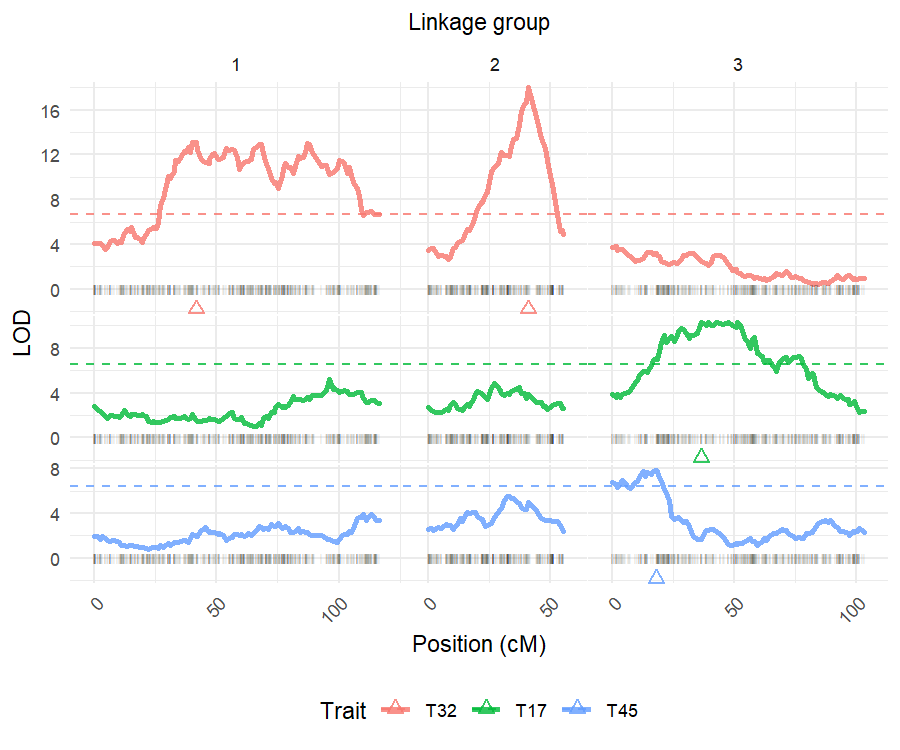

Notice that one QTL on LG 1 was not detected for the trait 'T32' (false negative), while one QTL on LG 3 for the trait 'T45' was wrongly assigned (false positive). This exemplifies the power of multiple-QTL models over the single-QTL ones. Therefore, the FEIM model may be recommended only as a first, quick approach, but not as the ultimate model for detecting QTL in autopolyploid species. 

# Acknowledgments

This package has been developed as part of the [Genomic Tools for Sweetpotato Improvement](https://sweetpotatogenomics.cals.ncsu.edu/) (GT4SP) project, funded by [Bill \& Melinda Gates Foundation](https://www.gatesfoundation.org/How-We-Work/Quick-Links/Grants-Database/Grants/2014/08/OPP1052983).

# References

