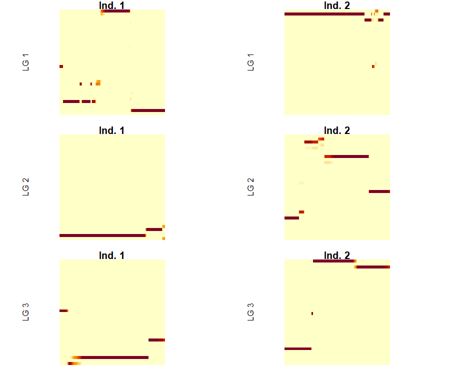
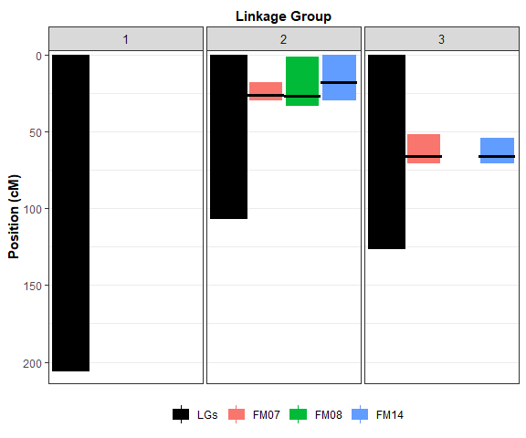
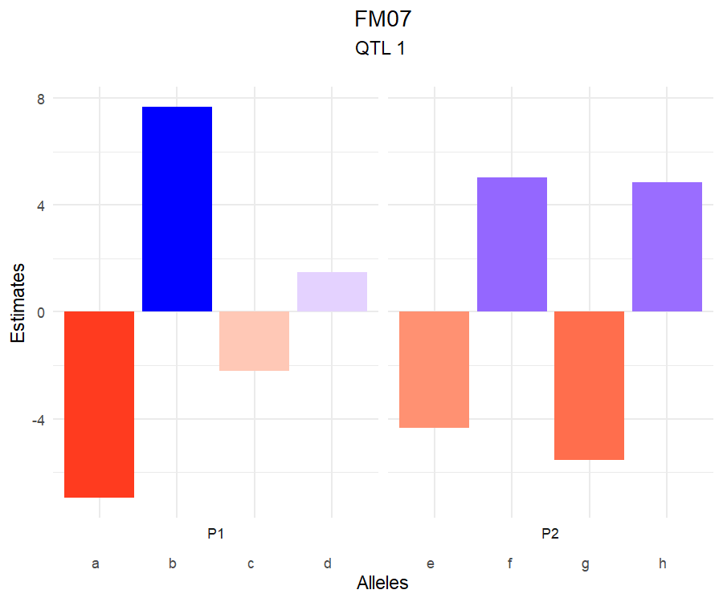
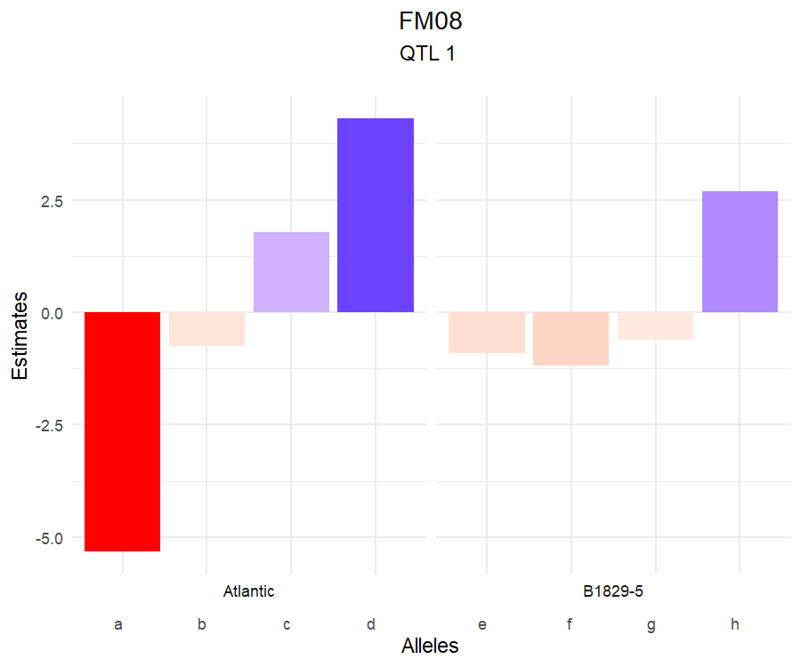
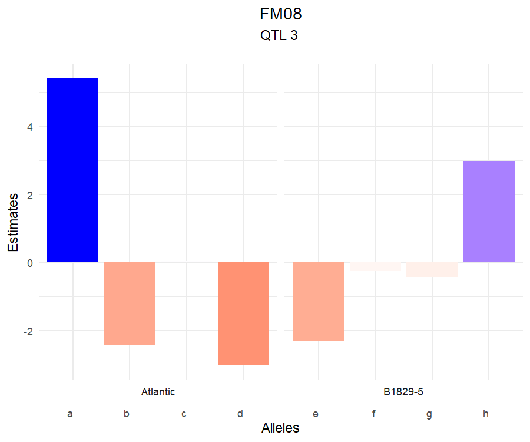
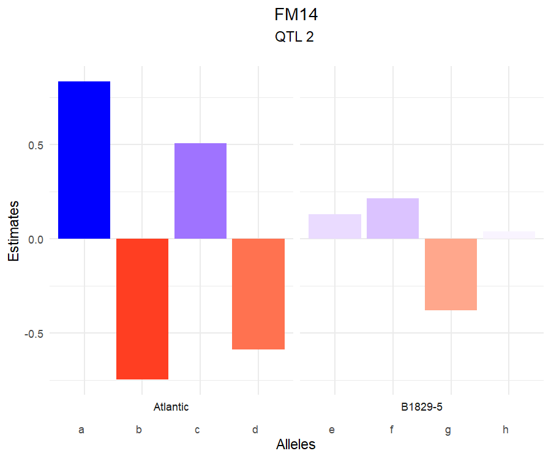
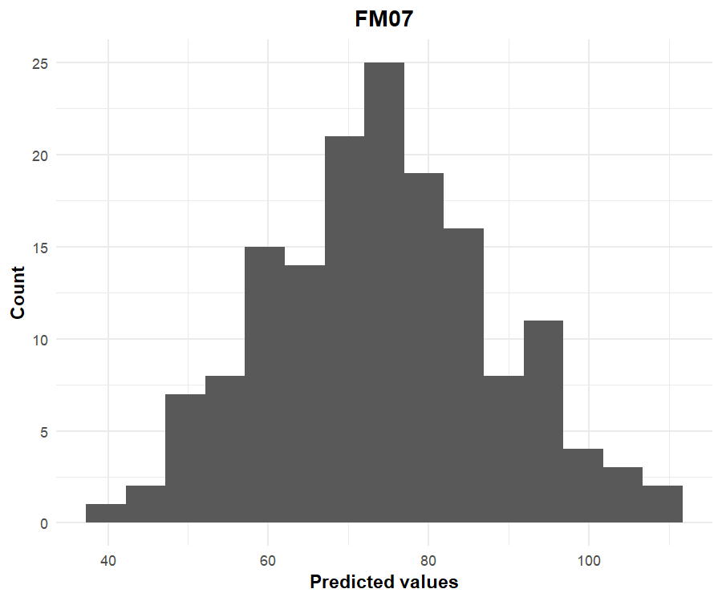
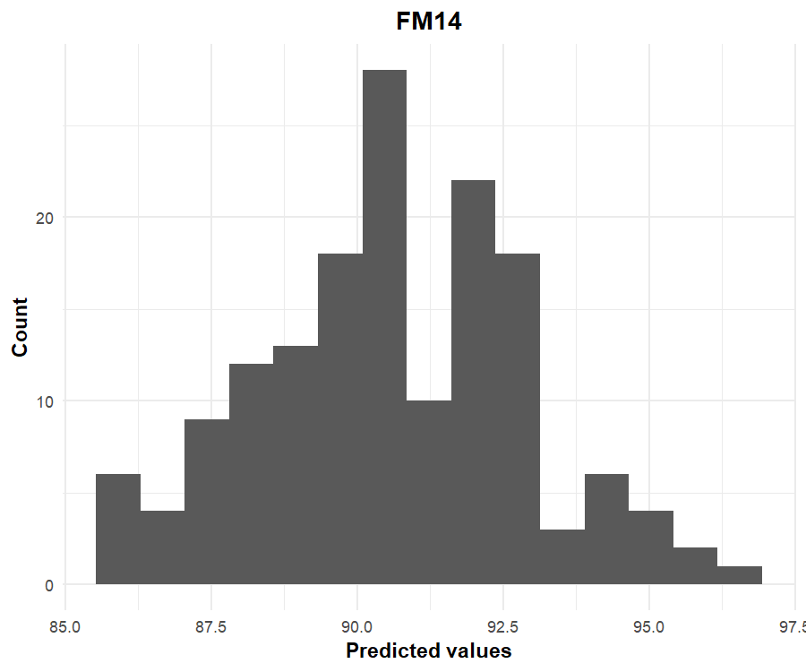

# Code


# Introduction

Quantitative trait loci (QTL) mapping studies main goal is to investigate the genetic architecture of traits of interest. Single- and multiple-QTL models have been available for inbred, diploid mapping populations for quite some time now (see @DaCostaeSilva2010 for a comprehensive review). However, only recently these methods became available for outbred, polyploid mapping populations. 

The R package `qtlpoly` (v. 0.2.1) is an under development software to map multiple QTL in full-sib families of outcrossing, autopolyploid species [@Pereira2020]. It is based on the partition of the phenotypic variance ($\sigma^2_p$) into variance due to QTL ($\sigma^2_q$) in addition to the residual variance ($\sigma^2_e$) as follows:

$$\sigma^2_p = \sum_{q=1}^Q \boldsymbol{G}^{(i,i')}_q\sigma^2_q + \sigma^2_{e}$$

where $\boldsymbol{G}^{(i,i')}_q$ is the additive relationship between full-sibs $i$ and $i'$, whose computation is based on the genotype conditional probabilities of QTL $q$. See how to estimate these genotype probabilities using [`mappoly`](https://github.com/mmollina/MAPPoly) in @Mollinari2020. 

Because we only need to estimate one parameter per QTL (the very variance component associated with it), it is relatively easy to look for additional QTL and add them to the variance component model, without ending up with an overparameterized model. A multiple-QTL model is known to have increased power when compared to a single-QTL model, with ability to detect minor or separate linked QTL [@Pereira2020].

Variance components associated with putative QTL ($\sigma^2_q$) are tested using score statistics from the R package `varComp` (v. 0.2-0) [@Qu2013]. Final models are fitted using residual maximum likelihood (REML) from the R package `sommer` (v. 3.6) [@Covarrubias-Pazaran2016]. Plots for visualizing the results are based on `ggplot2` (v. 3.1.0) [@Wickham2016]. 

This tutorial was first developed for the [Polyploid Tools Training Workshop](https://www.polyploids.org/workshop/2021/january/info) (December 12-15, 2021), and tested in R version 4.0.3 (2020-10-10) running on either Ubuntu 18.04.1 LTS (64-bit) or Windows 10.

## Installing the `qtlpoly` package

In order to run this tutorial, you will need to install the `qtlpoly` package, which is available at [GitHub](https://github.com/guilherme-pereira/qtlpoly). You can install all needed packages within R using the commands below:


```r
install.packages(c("devtools", "data.table"))
devtools::install_url("https://cran.r-project.org/src/contrib/Archive/SPA3G/SPA3G_1.0.tar.gz")
devtools::install_url("https://cran.r-project.org/src/contrib/Archive/varComp/varComp_0.2-0.tar.gz")
devtools::install_version("sommer", version = "3.6", repos = "http://cran.us.r-project.org", 
    upgrade = FALSE)
devtools::install_github("guilherme-pereira/qtlpoly", upgrade = FALSE)
```

If you have installed `qtlpoly` before, please make sure to run the last line of the installation process again, so that you will have all the last updates. Then, use the function `library()` -- or `require()` -- to load the package:


```r
## devtools::install_github("guilherme-pereira/qtlpoly", upgrade = FALSE)
library(qtlpoly)
```

## Tetraploid potato data

A cross between two potato (*Solanum tuberosum*, 2*n* = 4*x* = 48) cultivars, 'Atlantic' $\times$ 'B1829-5', resulted in 154 full-sibs. The population has been phenotyped (4-year evaluation) and genotyped (8k SNP array), and analyses have been performed to call SNP dosage, build a genetic map and map QTL [@Pereira2020a]. 

For brevity's sake, we have selected three phenotypes (foliage maturity evaluated in years 2007, 2008 and 2014, i.e. FM07, FM08 and FM14) and three linkage groups (LGs, namely 1, 5 and 7) for this demo. Foliage maturity is measured as the "area under the curve" of foliage color along the plant cycle. All analyses can be found at [this GitHub page](https://github.com/mmollina/B2721_map/), though. 

Use the function `data()` to preload the genotype probabilities computed in the LGs 1, 5 and 7 (now called 1, 2 and 3, respectively) as well as the phenotypic data:


```r
data("genoprob4x")
data("pheno4x")
```

The `genoprob4x` object contains the genotype probability along the LGs for each individual, reflecting all recombination events. For example, individuals 1 and 2 show the following patterns of genotype probabilities, and so will every other individual:


```r
par(mfrow = c(3, 2), pty = "s", mar = c(1, 1, 1, 1))
for (i in 1:3) {
    image(t(genoprob4x[[i]]$probs[, , 1]), axes = FALSE, ylab = paste("LG", 
        i), main = "Ind. 1")
    image(t(genoprob4x[[i]]$probs[, , 2]), axes = FALSE, ylab = paste("LG", 
        i), main = "Ind. 2")
}
```



The `pheno4x` object contains the phenotypic values of foliage maturity for years 2007, 2008 and 2014:


```r
library(ggplot2)
ggplot() + geom_boxplot(data = stack(as.data.frame(pheno4x)), aes(x = ind, y = values, 
    color = ind)) + xlab("Trait") + theme(legend.position = "none")
```


In a region where a QTL exists, the more alleles a pair of individuals share, the more their phenotypes will look alike. In fact, this is the basis of QTL detection.

# Getting the data ready

The function `read_data()` reads both 'genoprob' and 'pheno' objects, together with other relevant information like the ploidy level (`ploidy = 4`), and the step size (`step = 1`) in which tests will be performed. A `print` function provides detailed information on the data: 


```r
data <- read_data(ploidy = 4, geno.prob = genoprob4x, pheno = pheno4x, step = 1)
print(data, detailed = TRUE)
## Reading the following data: 
##   Ploidy level:       4
##   No. individuals:    156
##   No. linkage groups: 3
##   Step size:          1 cM 
##   Map size:           438.17 cM (443 positions) 
##   No. phenotypes:     3
## This is an object of class 'qtlpoly.data'
##   Ploidy level:       4
##   No. individuals:    156
##   No. linkage groups: 3
##   Step size:          1 cM 
##   Map size:           438.17 cM (443 positions) 
##     LG 1: 205.88 cM (207 positions) 
##     LG 2: 106.2 cM (108 positions) 
##     LG 3: 126.09 cM (128 positions) 
##   No. phenotypes:     3
##     Trait 1: 'FM07' (141 individuals) 
##     Trait 2: 'FM08' (143 individuals) 
##     Trait 3: 'FM14' (140 individuals)
```

# Performing QTL detection

A algorithm proposed for QTL model selection [@Kao1999] is available within the software, and it can be described as follows:

0. Null model: for each trait, a model starts with no QTL
$$\sigma^2_p = \sigma^2_{e}$$
1. Forward search: QTL ($q = 1, \dots, Q$) are added one at a time, conditional to the one(s) (if any) already in the model, under a less stringent genome-wide significance level (e.g., $\alpha < 0.20$)
$$\sigma^2_p = \sum_{q=1}^Q \boldsymbol{G}^{(i,i')}_q \sigma^2_q + \sigma^2_{e}$$
2. Model optimization: each QTL $r$ is tested again conditional to the remaining one(s) in the model under a more stringent genome-wide significance level (e.g., $\alpha < 0.05$)
$$\sigma^2_p = \boldsymbol{G}^{(i,i')}_r \sigma^2_r + \sum_{q \neq r} \boldsymbol{G}^{(i,i')}_q \sigma^2_q + \sigma^2_{e}$$
Steps 1 and 2 iterate until no more QTL can be added to or dropped from the model, and positions of the remaining QTL do not change. After the first model optimization round, the following forward searches use the more stringent threshold (e.g., $\alpha < 0.05$).
3. QTL profiling: score statistics for the whole genome are updated conditional to the final set of selected QTL.

## Score-based resampling to assess genome-wide significance

Rather than guessing pointwise significance levels for declaring QTL, you can use the score-based resampling method to assess the genome-wide significance level [@Zou2004]. This method is relatively intensive, because it involves score statistics computation for every position in the map repeated 1,000 times (resampling): 


```r
## data.sim <- simulate_qtl(data = data, mu = 0, h2.qtl = NULL, var.error = 1, 
##     n.sim = 1000, missing = TRUE, seed = 123)
## score.null <- null_model(data = data.sim$results, n.clusters = 6, plot = NULL)
min.pvl <- numeric(length(score.null$results))
for (p in 1:length(score.null$results)) {
    min.pvl[p] <- score.null$results[[p]]$pval[which.max(score.null$results[[p]]$stat)]
}
quantile(sort(min.pvl), c(0.2, 0.05))
##          20%           5% 
## 0.0011493379 0.0002284465
```

Therefore, we ran it in advance and learned that genome-wide significance levels of $\alpha=0.20$ and $\alpha=0.05$ match $P < 0.0011493$ and $P < 2.2844648\times 10^{-4}$, respectively, which will be used next.

## Searching for QTL

Now, we are to use the `remim` function for building our multiple QTL model. One should include the `data` object, the window size (`w.size = 15`), the value $d$ that is decreased from the log of $P$-value to compute the support interval (`d.sint = 1.5` for ~95\%), and the number of cores to be used (`n.clusters = 6`).

In case you have computed the 'score.null' object, both forward search (`sig.fwd = 0.20`) and backward elimination (`sig.bwd = 0.05`) will reflect the desired genome-wide significance levels ($\alpha$):


```r
remim.mod <- remim(data = data, w.size = 15, score.null = score.null, sig.fwd = 0.2, 
    sig.bwd = 0.05, d.sint = 1.5, n.clusters = 6, plot = "remim4x")
```

Otherwise, you can just include the pointwise significance level computed before based on our resampling method, which is the option we are going to use here:


```r
remim.mod <- remim(data = data, w.size = 15, sig.fwd = 0.0011493379, sig.bwd = 0.0002284465, 
    d.sint = 1.5, n.clusters = 6, plot = "remim4x")
## INFO: Using 6 CPUs for calculation
## 
## REMIM for trait 1 'FM07' 
##   QTL was found on LG 2 at 26 cM (position number 234)
##   QTL was found on LG 3 at 66 cM (position number 382)
##   No more QTL were found. A putative QTL on LG 1 at 8 cM (position number 9) did not reach the threshold; its p-value was 0.04462
##   Refining QTL positions ... 234 ... 382 
##   Profiling QTL ... 234 ... 382 
##   Calculation took 174.14 seconds
## 
## REMIM for trait 2 'FM08' 
##   QTL was found on LG 2 at 27 cM (position number 235)
##   QTL was found on LG 3 at 66 cM (position number 382)
##   QTL was found on LG 1 at 9 cM (position number 10)
##   No more QTL were found. A putative QTL on LG 3 at 110 cM (position number 426) did not reach the threshold; its p-value was 0.00419
##   Refining QTL positions ... 236 ... 381 ... 10 
##   Profiling QTL ... 10 ... 235 ... 381 
##   Calculation took 385.53 seconds
## 
## REMIM for trait 3 'FM14' 
##   QTL was found on LG 2 at 26 cM (position number 234)
##   QTL was found on LG 3 at 66 cM (position number 382)
##   No more QTL were found. A putative QTL on LG 3 at 2 cM (position number 318) did not reach the threshold; its p-value was 0.08978
##   Refining QTL positions ... 226 ... 382 
##   Profiling QTL ... 226 ... 382 
##   Calculation took 172.41 seconds
```

Use `print()` and a summary table for each trait will be shown:


```r
print(remim.mod)
## This is an object of class 'qtlpoly.remim'
## 
## * Trait 1 'FM07' 
##   LG Pos Nmrk    Mrk  Score      Pval
## 1  2  26  234 loc_26 355.99 <2.22e-16
## 2  3  66  382 loc_66 167.43  8.98e-07
## 
## * Trait 2 'FM08' 
##   LG Pos Nmrk    Mrk  Score      Pval
## 1  1   9   10  loc_9 101.58  2.16e-04
## 2  2  27  235 loc_27 425.04 <2.22e-16
## 3  3  65  381 loc_65 104.85  2.00e-04
## 
## * Trait 3 'FM14' 
##   LG Pos Nmrk    Mrk  Score     Pval
## 1  2  18  226 loc_18 197.01 9.77e-08
## 2  3  66  382 loc_66 138.45 1.57e-05
```

Since support intervals have been calculated, you can print them as well by specifying the `sint` argument properly:


```r
print(remim.mod, sint = "lower")
## This is an object of class 'qtlpoly.remim'
## 
## * Trait 1 'FM07' 
##   LG Pos_lower Nmrk_lower Mrk_lower Score_lower Pval_lower
## 1  2        18        226    loc_18      293.50  <2.22e-16
## 2  3        52        368    loc_52      129.17   2.50e-05
## 
## * Trait 2 'FM08' 
##   LG Pos_lower Nmrk_lower Mrk_lower Score_lower Pval_lower
## 1  1         0          1  c2_51460       74.70   1.96e-03
## 2  2         0        208  c2_23776      283.91  <2.22e-16
## 3  3        35        351    loc_35       64.98   5.74e-03
## 
## * Trait 3 'FM14' 
##   LG Pos_lower Nmrk_lower Mrk_lower Score_lower Pval_lower
## 1  2         0        208  c2_23776      170.29   5.87e-07
## 2  3        54        370    loc_54       97.91   4.43e-04
```


```r
print(remim.mod, sint = "upper")
## This is an object of class 'qtlpoly.remim'
## 
## * Trait 1 'FM07' 
##   LG Pos_upper Nmrk_upper Mrk_upper Score_upper Pval_upper
## 1  2        29        237    loc_29      321.09  <2.22e-16
## 2  3        70        386    loc_70      146.96   6.68e-06
## 
## * Trait 2 'FM08' 
##   LG Pos_upper Nmrk_upper Mrk_upper Score_upper Pval_upper
## 1  1        32         33    loc_32       67.51   4.56e-03
## 2  2        41        249    loc_41      308.78  <2.22e-16
## 3  3        71        387    loc_71       69.15   3.99e-03
## 
## * Trait 3 'FM14' 
##   LG Pos_upper Nmrk_upper Mrk_upper Score_upper Pval_upper
## 1  2        29        237    loc_29      169.67   2.37e-06
## 2  3        70        386    loc_70      109.05   1.82e-04
```

## Visualizing results graphically

Given the final profiled models, you can plot either individual or joint $LOP$ profiles using the function `plot_profile()`. Triangles show where the mapped QTL peaks are located: 


```r
plot_profile(data = data, model = remim.mod, grid = TRUE)
```



```r
plot_profile(data = data, model = remim.mod, grid = FALSE)
```


The argument `grid` organizes the multiple plots as a grid if `TRUE`, or superimposed profiles if `FALSE`.

You can visualize the QTL distributed along the linkage map, together with their support intervals using the function `plot_sint()`: 


```r
plot_sint(data = data, model = remim.mod)
```


# Fitting multiple QTL models

Once final models have been defined, one may use REML to estimate their parameters by using the function `fit_model()`:


```r
fitted.mod <- fit_model(data = data, model = remim.mod)
## There are 2 QTL in the model for trait 1 'FM07'. Fitting model... Done! 
## 
## There are 3 QTL in the model for trait 2 'FM08'. Fitting model... Done! 
## 
## There are 2 QTL in the model for trait 3 'FM14'. Fitting model... Done!
```

A `summary()` function shows parameter estimates together with the QTL heritabilities computed from the variance component estimates:


```r
summary(fitted.mod)
## This is an object of class 'qtlpoly.fitted'
## 
## * Trait 1 'FM07' 
##   LG Pos Nmrk Intercept   Var(g)   Var(e)        h2
## 1  2  26  234        NA 336.2883       NA 0.5769673
## 2  3  66  382        NA 72.76961       NA 0.1248503
## 3 NA  NA   NA  73.17467       NA 173.7972 0.7018176
## 
## * Trait 2 'FM08' 
##   LG Pos Nmrk Intercept   Var(g)   Var(e)         h2
## 1  1   9   10        NA 117.4037       NA 0.07430268
## 2  2  27  235        NA 1010.584       NA  0.6395801
## 3  3  65  381        NA 112.6918       NA 0.07132057
## 4 NA  NA   NA  79.20089       NA 339.3945  0.7852034
## 
## * Trait 3 'FM14' 
##   LG Pos Nmrk Intercept   Var(g)   Var(e)        h2
## 1  2  18  226        NA 7.123422       NA 0.2982218
## 2  3  66  382        NA 4.006484       NA 0.1677313
## 3 NA  NA   NA  90.51603       NA 12.75642  0.465953
```

Another way of visualization you can use is the one provided by the function `plot_qtl()`:


```r
plot_qtl(data = data, model = remim.mod, fitted = fitted.mod)
```



Dots are located on the respective LG positions of the QTL peaks. Size of the dots corresponds to the specific QTL heritability. Color of the dots corresponds to the $P$-values, and helps to identify the most or the less significant QTL. 

## Estimate allele effects

Additive effects contributing to the overall mean by each allele individually as well as their combinations within each parent may be computed using the function `qtl_effects()` as follows:


```r
est.effects <- qtl_effects(ploidy = 4, fitted = fitted.mod)
## There are 2 QTL in the model for trait 1 'FM07'. Computing effects for QTL ... 234 ... 382. Done! 
## 
## There are 3 QTL in the model for trait 2 'FM08'. Computing effects for QTL ... 10 ... 235 ... 381. Done! 
## 
## There are 2 QTL in the model for trait 3 'FM14'. Computing effects for QTL ... 226 ... 382. Done!
```

A `plot()` function allows the user to visualize these contributions graphically:


```r
plot(est.effects, p1 = "Atlantic", p2 = "B1829-5")
```



For each QTL, one will be able to see which alleles contribute the most to increase or decrease the phenotypic mean. For example, for QTL on LG 2, alleles *b* from 'Atlantic' and *f* and *h* from 'B1829-5' contributes to increasing the area under the curve and, thus, to decreasing maturity time.

## Predict breeding values

Finally, with the estimates of the final models in hands, one can use them to perform predictions of the QTL-based breeding values as follows:


```r
y.hat <- breeding_values(data = data, fitted = fitted.mod)
```

A `plot()` function shows the distribution of the genotypic values for the population:


```r
plot(y.hat)
```



This may also be interesting for those populations whose individuals have been genotyped, but not phenotyped, and you still want to consider them when selecting the best genotypes.

# Running a fixed-effect QTL model for comparison

A previous fixed-effect interval mapping (here named FEIM) model has been proposed as a first approach to map QTL in autopolyploid species [@Hackett2014]. It consists of a single-QTL model, where every position is tested according to the model:

$$Y = \mu_C + \sum_{i=2}^{m} \alpha_i X_i + \sum_{i=m+2}^{2m} \alpha_i X_i$$

where $\mu_C$ is the intercept, and $\alpha_i$ and $X_i$ are the main effects and indicator variables for allele $i$, respectively, and $n$ is the ploidy level. The constraints $\alpha_{1} = 0$ and $\alpha_{m+1} = 0$ are imposed to satisfy the condition $\sum_{i=1}^m X_i = m/2$ and $\sum_{i=m+1}^{2m} X_i = m/2$, so that $\mu_C$ is a constant hard to interpret due to these constraints. Notice that the higher the ploidy level, the more effects have to be estimated, i.e. tetraploid models have six main effects, hexaploid models have 10 effects, octoploid models will have 14 effects (i.e. $2m-2$).

Under REMIM model we test the variance components. Here, the interest is to know if the average allele effects are different from zero (the null hypothesis) using likelihood-ratio tests (LRT). Commonly, the tests are presented as "logarithm of the odds" (LOD scores), where $LOD = \frac{LRT}{2 \times \log_e(10)}$.

In order to evaluate significance (declare a QTL), empirical LOD thresholds are computed for each trait using permutations as proposed by @Churchill1994a. 

## LOD threshold permutations

Using the same object 'data' from REMIM analyses, one can first compute the thresholds for all or specific traits. The number of simulations `n.sim = 1000` can be parallelized by defining the number of cores (`n.clusters = 6`):


```r
## perm <- permutations(data = data, n.sim = 1000, n.clusters = 6)
print(perm)
## This is an object of class 'qtlpoly.perm'
## 
## * Trait 1 'FM07' 
##  90%  95% 
## 5.26 5.68 
## 
## * Trait 2 'FM08' 
##  90%  95% 
## 5.43 5.78 
## 
## * Trait 3 'FM14' 
## 90% 95% 
## 5.2 5.6
```

Since it takes some time to run all permutations, we will use the information previously obtained for $\alpha = 0.05$, i.e. 95\% quantile, in the subsequent FEIM analyses.

## Interval mapping

`feim` function tests every position from the specified step size from 'data' -- here, every 1 cM. Besides the `sig.lod` vector containing the thresholds for each trait, one needs to provide a window size (e.g., `w.size = 15`), which will be used to select QTL peaks within the same linkage group with a minimum distance of the given window size:


```r
feim.mod <- feim(data = data, w.size = 15, sig.lod = c(5.68, 5.78, 5.6))
## FEIM for trait 1 'FM07' 
##   QTL was found on LG 2 at 26 cM (position number 234)
##   QTL was found on LG 3 at 66 cM (position number 382)
## 
## FEIM for trait 2 'FM08' 
##   QTL was found on LG 2 at 28 cM (position number 236)
## 
## FEIM for trait 3 'FM14' 
##   QTL was found on LG 2 at 26 cM (position number 234)
##   QTL was found on LG 3 at 66 cM (position number 382)
## 
## Calculation took 1.99 seconds
```

A `print` function shows detailed information on the detected QTL:


```r
print(feim.mod)
## This is an object of class 'qtlpoly.feim'
## 
## * Trait 1 'FM07' 
##   LG Pos Nmrk    Mrk   LRT   LOD     AdjR2
## 1  2  26  234 loc_26 93.00 20.19 0.4597692
## 2  3  66  382 loc_66 35.01  7.60 0.1849254
## 
## * Trait 2 'FM08' 
##   LG Pos Nmrk    Mrk    LRT   LOD    AdjR2
## 1  2  28  236 loc_28 113.12 24.56 0.526639
## 
## * Trait 3 'FM14' 
##   LG Pos Nmrk    Mrk   LRT   LOD     AdjR2
## 1  2  26  234 loc_26 56.34 12.24 0.3011629
## 2  3  66  382 loc_66 29.63  6.43 0.1542524
```

Remember, in this case, one should not sum adjusted $R^2$ from the same trait, as each was obtained from a single-QTL model.

Finally, one may want to plot the profiles and compare with the profiles from REMIM:


```r
plot_profile(data = data, model = feim.mod, grid = TRUE)
```


Notice that, in comparison the REMIM results, the QTL on linkage groups 1 and 3 for FM08 are missing.

# Acknowledgments

This package has been developed as part of the [Genomic Tools for Sweetpotato Improvement](https://sweetpotatogenomics.cals.ncsu.edu/) (GT4SP) project, funded by [Bill \& Melinda Gates Foundation](https://www.gatesfoundation.org/How-We-Work/Quick-Links/Grants-Database/Grants/2014/08/OPP1052983).

# References

